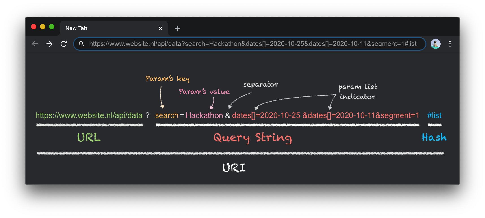

[](https://www.npmjs.com/package/query-string-modifier)


# Query String Modifier
Query String Modifier is an easy and robust way for manipulating / modifying data in a query string. The exposed `QueryString` class has a set of functions that modifies its local "query" string attribute, which is synced with the current window's query string by default, unless specified otherwise. For as little as `1.23 kB` overhead, it provides a cross-browser support for all its functions.

## Installation

```
npm i --save query-string-modifier
```

Then..
```js
import QueryString from 'query-string-modifier';

// Initialize QueryString obj with default behavior
const qs = new QueryString(); 

// Then Use it.. :)
qs.appendParam("someKey", "someValue");
let value = qs.get("someKey");   
...
```

## Terminology | What is a Query String?



## Constructor Options
- queryString: `string`
    - Query string which all function modifies.
    - Default = current window query string.
- hash: `string`
    - Default = current window hash
- origin: `string`
    - Default = current window origin
- route: `string`
    - Default = current window route
- autoUpdate: `true | false`
    - Update the current window's URI after each modification
    - Default = true

Using option to create a virtual query string, which can be used in Ajax calls, but it won't modify or change current window URI.
```js 
const virtualQS = new QueryString({ 
            queryString: "myCustom=String&key=value", 
            hash: "someHash", 
            autoUpdate: false
        })
```

You can also change all of these configuration after initialization with getter and setter, as follow `getHash()`, `setHash(newValue)`, `getAutoUpdate()`... etc.

## API
```js
import QueryString from 'query-string-modifier';

// Initialize QueryString obj with default behavior
const qs = new QueryString();

```

#### Getter and Setter
```js
/**
 * Get the whole query string attribute of qs instance
 * @return {String}
 */
qs.get()

/**
 * Set the internal attribute "this.queryString" to the given string
 * If "autoUpdate" option is set to true, it will update the window query string
 */
qs.set("segment=3&search=test")

/**
 * Check whether the autoUpdate is True / False
 * @return {boolean}
 */
qs.getAutoUpdate()

/**
 * Turn off the autoUpdate, so from now on, function calls
 * on qs won't change the window query string
 */
qs.setAutoUpdate(false)
```

#### Param functions
Note: all functions bellow manipulate `this.queryString` attribute of the initiated instance `qs`, and if `autoUpdate` option is set to true, it will update window URI after each operation/function.

```js
/**
 * Get the first value of a param
 * @return {String}
 */
qs.get(key)             // alias
qs.getValue(key)        // alias
qs.getParamValue(key)  

/**
 * Get a list of all values that corresponds to the given parameter's key.
 * @return {Array}
 */
qs.getValues(key)           // alias
qs.getAllValues(key)        // alias
qs.getAllParamValues(key)   

/**
 * Replace the value of the given parameter's key.
 * If the param key does not exist in the query string, it will append a new param.
 * If the value is falsy (except the integer 0), it will remove the param.
 */
qs.set(key, value)             // alias
qs.setParam(key, value)        // alias
qs.updateParam(key, value)     

/**
 * Append a new parameter (even if the key is already existed).
 * If the value is falsy (except int 0), return without appending.
 */
qs.append(key, value)           //alias
qs.appendParam(key, value)

/**
 * Remove the parameter given its key and value.
 * If value isn't given, remove all parameters corresponds to the given key.
 *
 * Option params:
 * @param {boolean} onlyFirstOccurrence set to true, to remove only the first occurrence
 * @param {boolean} noEscape set to true if you need to pass regex expression as a key
 */
qs.removeParam(key, value, onlyFirstOccurrence, noEscape)
qs.deleteParam(key, value, onlyFirstOccurrence, noEscape)   // alias

/**
 * Remove all parameters with the given key.
 *
 * Option params:
 * @param {boolean} onlyFirstOccurrence set to true, to remove only the first occurrence
 * @param {boolean} noEscape set to true if you need to pass regex expression as a key
 */
qs.removeKey(key, onlyFirstOccurrence, noEscape)
qs.deleteKey(key, onlyFirstOccurrence, noEscape)    // alias

/**
 * Check if qs has a parameter with the given key and value.
 * If the value is not set, then check whether any parameter has the given key.
 * @returns {boolean}
 *
 * Option params:
 * @param {boolean} noEscape set to true if you need to pass regex expression as a key
 */
qs.has(key, value, noEscape)        // alias
qs.hasParam(key, value, noEscape)

/**
 * Check if qs has a parameter with the given key.
 * @returns {boolean}
 *
 * Option params:
 * @param {boolean} noEscape set to true if you need to pass regex expression as a key
 */
qs.has(key)                 // alias
qs.hasKey(key, noEscape)

/**
 * Append/Remove the parameter given its key and value.
 */
qs.toggleParam(key, value)
```

#### Hash functions

```js
/**
 * Get the hash part of current window URI.
 * If "autoUpdate" is true, it will update "this.hash" attribute of qs instance.
 * @return {String}
 */
qs.getHash()

/**
 * Set "this.hash" of qs instance to the given hash.
 * It ignores the '#' char at the the start, so no need to include it.
 * If the given hash is falsy (but not 0), it will remove the hash part.
 * If "autoUpdate" is true, it will update window URI.
 */
qs.setHash(hashValue)

/**
 * Remove the value of "this.hash" of qs instance.
 * If "autoUpdate" is true, it will update window URI.
 */
qs.removeHash()
qs.deleteHash()    // alias
qs.setHash('')     // alias
```

#### Route functions

```js
/**
 * Get the route value at specific index.
 * This funstion accpet a negative index, where "-1" is the last value.
 * @param {int} index positive or negative number, where "-1" is the last value. 
 * @returns {String} value of route token
 */
getRouteAtIndex(index) {

/**
 * Update the route value at specific index.
 * The index can be negative, where "-1" is the last value.
 * If given value is empty, return without modifying the route
 * If "autoUpdate" is true, it will update window URI.
 * @param {int} index positive or negative number, where "-1" is the last value. 
 * @param {String} value the new value of the route at the given index. If empty, no modification will happen.
 * @returns {String} the updated route string
 */
updateRouteAtIndex(index, value) 
setRouteAtIndex(index, value)   // alias

/**
 * Delete the route value at specific index.
 * The index can be negative, where "-1" is the last value.
 * If "autoUpdate" is true, it will update window URI.
 * @param {int} index positive or negative number, where "-1" is the last value. 
 * @returns {String} the updated route string
 */
removeRouteAtIndex(index)
deleteRouteAtIndex(index) // alias
```
#### Window Query String functions

```js
/**
 * Get the query string part of the current window's URI.
 * This will update "this.queryString" and "this.hash" of the qs instance.
 * @return {String}
 */
qs.getWindowQueryString()

/**
 * Silent update the current window's URI without reload
 * using the origin, route, queryString and hash of this instance.
 * @return the updated URI string
 */
qs.updateWindowURI()
qs.updateQueryString()          //alias
qs.updateWindowQueryString()    //alias
```

#### More functions

```js
/**
 * Get all parameters as an object where:
 *  - { key: value } for single value params,
 *  - { key[]: [values_array] } for list parameters (ie. key name end with [])
 * @return {Object} Object with all parameter of this queryString
 */
qs.getAllParams()

/**
 * Get sorted array in ascending order of all dates from "this.queryString".
 * @param {String} dateParamKey the parameter's key of the dates (default => "dates[]").
 * @return {Array} sorted array of date-strings
 */
qs.getDateList(dateParamKey)
```


## Changes history

#### v2.8.7
- Fix bug on function `hasKey()` where no value was returned.
- alias: 
    - `has(key, value, noEscape)` = `hasParam(key, value, noEscape)`
    - `append(key, value)` = `appendParam(key, value)`
#### v2.8.0
- Support modifing routes value using index:
    - `getRouteAtIndex(index)`
    - `setRouteAtIndex(index, value)` = `updateRouteAtIndex(index, value)`
    - `removeRouteAtIndex(index)` = `deleteRouteAtIndex(index)`
- Manage the state of the whole URI string, including origin and route/pathname locally, such that making virtual instance (ie, `autoUpdate = false`) won't effect current window URI.
- Add `origin` and `route` to constructor options/config
- Add API documentation for new functions
- Aliases:
    - updateWindowURI = updateWindowQueryString = updateQueryString
#### v2.7.0
- API documentation
- `set()` function can be used as `updateParam()` if a second parameter is passed
- Enhance internal documentation
- Aliases:
    - updateWindowQueryString = updateQueryString
    - `set(key, value)` = `updateParam(key,value)`

#### v2.6.5
- Fix bug when the parameter value or key aren't strings and need to be escaped

#### v2.6.4
- Add `hashKey()` function which is an alias to `hasParam()` with 2nd argument 'value' set to false; given a key, it checks if the string has any param with that key. The second argument is the option `noEscape`, set this to true in case the key is a regex value.
- Improve matching in `hasParam()` to strictly match the key and value, so it won't return `true` in such case the value is partially matched.
    - _Example:_ given query string `...&key=value&...`, now `hasParam("key", "val")` will return `false`.
    
#### v2.6.3
- Fix bug in the default value of the constructor
- Fix/Enhance matching for key and value with regards to prior/next `&` char. The previous matching causes removeKey to delete both `&` if the param exists in the middle
- `this.hash` doesn't start with `#` anymore, all hash functions get/set/delete are adjusted accordingly.

#### v2.6.0
- Change constructor to take object as parameter instead of passing one-by-one value. Check options example.
- getHash() will fetch current windows hash before return if autoUpdate option is set to true.

#### v2.5.0
- getAllParams to return an object with all `{ key: value }` pairs. Also support key with list of values, as long the key name end with `[]`
- Decode uri params of the query string when performing operation require key lookup like get, set, delete.. etc. So, no need to worry if the query string is encoded.
- Aliases:
    - getValue = getParamValue
    - getAllValues = getAllParamValues
    - getValues = getAllParamValues

#### v2.4.0 
- [Fix] Bind all class' methods to "this" in constructor

#### v2.3.0 
- get/set/removeHash
- Aliases:
    - setParam = updateParam
    - deleteParam = removeParam
    - deleteKey = removeKey

#### v2.2.0 
- Back to ES6 syntax
- togglePram, hasParam and removeKey functions
- updateParam will remove the key if value is falsy
- Simplify constructor
- Typos

#### v2.1.0 
- General enhancements

#### v2.0.0 
- Refactor all functions to one QueryString class.
- The class has attribute `this.queryString`, where all class' functions manipulate it, instead of the windows query string directly.
- Auto sync `this.queryString` with window query string, unless `autoUpdate` is false, which can be set through constructor or later with `setAutoUpdate()` function.

#### v1.0.0
- Utilities functions inside `uri-params.js` file that operate on windows query string by default:
    - updateQueryParams(params)
    - getQueryParams(key)
    - getQueryDateList()
    - updateOrAddParam(key, value, queryString)
    - appendParam(key, value, queryString)
    - deleteParam(key, value, needEscape, queryString)
